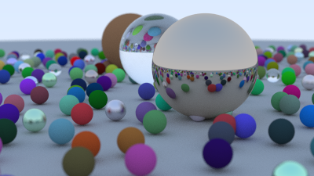

Ray Tracer in Rust : AMA
========================

Author: David Beazley (http://www.dabeaz.com)  
June 27, 2025  

Welcome!
--------

If you're looking for a good "nuts and bolts" project for learning
some Rust basics, Peter Shirley's excellent <a
href="https://raytracing.github.io/books/RayTracingInOneWeekend.html">Ray
Tracing in One Weekend</a> project might fit the bill.  Not only do
you get to make some pretty pictures, you'll get to scratch your head
as you ponder how to port various parts of the associated C++ code.
Plus, there is a lot of math!

About This Repository
--------------------

I have coded the Ray Tracer project from scratch about six times in
the context of teaching.  What you'll find here is my latest "best
effort" human-written solution to the Ray Tracer project. Every line
of this code has been written with purposeful intent and can be
explained further (by me).  No LLMs or other coding assistants were
used.  In addition, no line of code was written by blindly accepting 
a suggestion from the Rust compiler without conducting further
research.

I thought about writing a blog post about all of this, but then I
decided I'd flip the script around.  Instead of doing that, I present
all of this code without commentary and await YOUR questions.  In
fact, I'd love to answer questions about this code or Rust in
general!

Thus, view this repository as a kind of "Ask Me Anything" project.
If you want to ask a question, please direct your attention to
GitHub discussions.  I will make a best effort to respond. 

How to Proceed
--------------

If you've never attempted the Ray Tracer project, I highly recommend
that you go to the [above
link](https://raytracing.github.io/books/RayTracingInOneWeekend.html)
and try to independently come up with your own Rust solution first.
In doing that, I wouldn't even look at the code here--if you're
serious about learning, I think it's important for you to fumble
around, make mistakes, and scratch your head.  When you're done, come
back here, compare code, and ask questions.

A Bit More About the Code
-------------------------

In writing this code, my goal was to do more than simply port the
existing C++ code to Rust.  I wanted to write the code in an idiomatic
manner that was faithful to both Rust and some principles generally
associated with well written software such as making proper use of
abstraction and encapsulation.  There is also an ergonomic aspect to
the whole affair--I wanted the final code to look reasonably nice
without getting get too bogged down by low-level details.
Although I didn't make any effort to optimize the code, it runs faster
than the original C++ code when I time it.

The code has been formatted using `rustfmt` and should compile
without warning messages.  There is a third-party dependency on
the "fastrand" crate.   Ray tracing is slow--everything will run
a lot faster if you run things using release mode. 

Contributing
------------

I don't accept pull requests, but if you think you've found a bug or
have a suggestion for improvement, please submit a GitHub issue for
discussion.

Take a Course!
--------------

I teach courses related to a variety of advanced programming and
computer science related topics.  If this sounds interesting, please go
[here](https://dabeaz.com/courses.html).

Cheers,  
David Beazley (http://dabeaz.com)  

